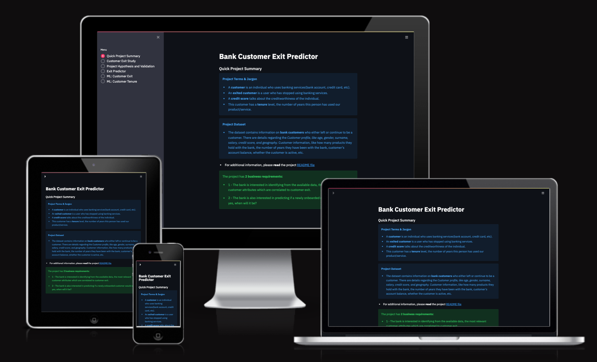
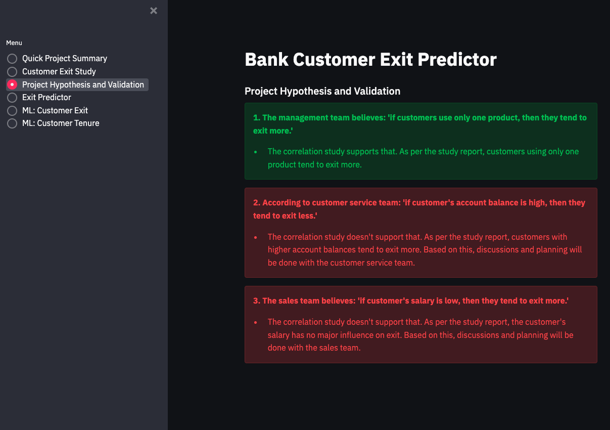
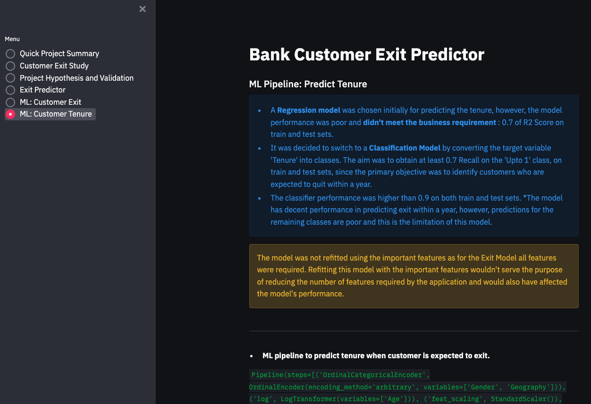

# Bank Customer Exit Predictor

We are utilizing predictive analytics in the banking industry to study and understand causes leading to customer exit.

The projects aims at creating a predictive model which would aid the bank(client) in understanding possible customer behaviour with respect to exiting banking services.

- Deployed App: [BankCustomerExitPredictor](https://bank-customer-exit-predictor-dbdb1b503bbc.herokuapp.com/)

---

# Table Of Content

- [Dataset Content](#dataset-content)
- [Business Requirements](#business-requirements)
  - [Scenario(hypothetical situation)](#scenariohypothetical-situation)
  - [Requirements](#requirements)
- [Hypothesis and how to validate?](#hypothesis-and-how-to-validate)
- [The rationale to map the business requirements to the Data Visualizations and ML tasks](#the-rationale-to-map-the-business-requirements-to-the-data-visualizations-and-ml-tasks)
   - [Business Requirement 1: Data Visualization and Correlation study](#business-requirement-1-data-visualization-and-correlation-study)
   - [Business Requirement 2: Classification, Regression and Data Analysis](#business-requirement-2-classification-regression-and-data-analysis)
- [ML Business Case](#ml-business-case)
  - [Predict Customer Exit](#predict-customer-exit)
    - [Classification Model](#classification-model)
  - [Predict Tenure](#predict-tenure)
    - [Regression Model](#regression-model)
- [Dashboard Design](#dashboard-design)
  - [Page 1: Quick project summary](#page-1-quick-project-summary)
  - [Page 2: Customer Exit Study](#page-2-customer-exit-study)
  - [Page 3: Project Hypothesis and Validation](#page-3-project-hypothesis-and-validation)
  - [Page 4: Customer Exit and Tenure Predictor](#page-4-customer-exit-and-tenure-predictor)
  - [Page 5: ML Analysis Customer Exit](#page-5-ml-analysis-customer-exit)
  - [Page 6: ML Analysis Tenure](#page-6-ml-analysis-tenure)
- [Project Management](#project-management)
- [Future Features](#future-features)
- [Manual Testing and Unfixed Bugs](#manual-testing-and-unfixed-bugs)
- [Technologies](#technologies)
  - [Main Development Environments and Editors](#main-development-environments-and-editors)
  - [Main Data Analysis and Machine Learning Libraries](#main-data-analysis-and-machine-learning-libraries)
- [Deployment](#deployment)
  - [Prerequisite](#prerequisite)
  - [Heroku](#heroku)
  - [Creating A Fork](#creating-a-fork)
- [Credits](#credits)
  - [Content](#content)
  - [Code](#code)
  - [Acknowledgements](#acknowledgements)
  - [Conclusion](#conclusion)

---

## Dataset Content

The dataset is sourced from [Kaggle](https://www.kaggle.com/datasets/shubhammeshram579/bank-customer-churn-prediction/data).
It contains information on bank customers who either left the services or continue to be a customer. There are details regarding:

- Customer profile, like age, gender, surname, salary, credit score, and geography.
- Customer information, like how many products they hold with the bank, the number of years they have been with bank, customer's account balance, whether the customer is active.

| Variable        | Meaning                                                                            |
| --------------- | ---------------------------------------------------------------------------------- |
| CustomerID      | A unique identifier for each customer                                              |
| Surname         | The customer's surname or last name                                                |
| Credit Score    | A numerical value representing the customer's credit score                         |
| Geography       | The country where the customer resides (France, Spain or Germany)                  |
| Gender          | The customer's gender (Male or Female)                                             |
| Age             | The customer's age.                                                                |
| Tenure          | The number of years the customer has been with the bank                            |
| Balance         | The customer's account balance                                                     |
| NumOfProducts   | The number of bank products the customer uses (e.g., savings account, credit card) |
| HasCrCard       | Whether the customer has a credit card (1 = yes, 0 = no)                           |
| IsActiveMember  | Whether the customer is an active member (1 = yes, 0 = no)                         |
| EstimatedSalary | The estimated salary of the customer                                               |
| Exited          | Whether the customer has churned (1 = yes, 0 = no)                                 |

- **Project Terms & Jargon**
  - A customer is an individual who uses banking services(bank account, credit card, etc).
  - An exited customer is a user who has stopped using banking services.
  - A credit score talks about the creditworthiness of the individual.

---

## Business Requirements

### Scenario(hypothetical situation):

As a Data Analyst at Best Bank (a multinational bank), you have been requested to study and understand customer behaviour in three countries (France, Spain, and Germany). The bank is concerned with the customer exit occurring within a year in these locations and is interested in developing a strong customer base by providing its sales and service teams better insights based on the predictive model designed by you. The bank has provided you with customer base data.

### Requirements:

1. The bank is interested in identifying from the available data the most relevant customer attributes that are correlated to customer exit.

   - From this analysis bank would like to understand the factors leading to customer exit in these markets so that new strategies can be implemented and designed accordingly.

1. The bank is also interested in predicting if a newly onboarded customer would exit. If yes, when?
   - From this prediction bank would like to understand the possible future behaviour of customers and assist its sales and customer care team in planning future interactions with customers to retain them. The Bank is especially concerned with exits happening within a year of onboarding. 

---

## Hypothesis and how to validate?

1. The management team believes, customers who use only one product tend to exit.
   - A study of correlation between NumOfProducts(variable) and Exited(target) can help us identify this 

1. As per the customer service team, the customer's account balance has no impact on exit.
   - A correlation study between account balances and Exited can help us confirm this

1. The sales team believes that the customer's salary is the most important factor in deciding exit.
   - A correlation study between all customer attributes and Exited can confirm this

---

## The rationale to map the business requirements to the Data Visualizations and ML tasks

### Business Requirement 1: Data Visualization and Correlation study

- We will be reviewing the data provided by the bank
- We will do a correlation study using Pearson and Spearman to understand how different customer attributes (variables) are correlated to Exited(target).
- We would visualize insights by plotting important customer attributes(important variables) against Exited(target).

### Business Requirement 2: Classification, Regression and Data Analysis

- We would like to predict if a newly onboarded customer will exit using a Binary Classification.
- We would like to predict when a newly onboarded customer who is expected to exit will leave.

---

## **ML Business Case**

### **Predict Customer Exit** 

#### **Classification Model**

- Based on the available historical data we want to predict if an onboarded customer would exit. We won't include CustomerID, Tenure, Surname, and RowNumber as these features would be irrelevant to our study. The target variable would be categorical comprising of 2 classes (Binary Classification). We will consider a Classification Model involving supervised learning, 2-class, single-label. Model output: 0 (No-Exit), 1 (Will-Exit)
- Our ideal outcome is to provide our sales and customer care team with reliable insight into how to interact with a newly onboarded customer.
- The model success metrics are
  - At least 70% Recall for Exit, on train and test set
  - The ML model is considered a failure if:
    - Within 1 year of onboarding, more than 30% of customers exit.
      - This shows that either customers are not happy with the basic services or the model is inefficient in predicting customer exit.
    - Precision for Stay is lower than 70% on the train and test set.
      - We don't want excessive interaction to cause inconvenience to non-exiting customers.
- The model output is defined as a class confirming if an onboarded customer Will-Exit or No-Exit and the associated probability of exiting. Based on the output, the sales and customer care team can proceed with necessary interactions to retain the customer.
- Heuristics: Currently, the approach is to take feedback through E-mail and phone calls for customers who have given marketing consent. Also, face to face interactions if a customer visits the branch.
- The training data to fit the model is provided by the bank. This dataset contains about 10 thousand customer records.
  - Train data - target: Exited; features: all other variables, but CustomerID, Tenure, Surname, and RowNumber.

#### Model Performance

### **Predict Tenure**

#### **Regression Model**

- We want an ML model to predict tenure levels, in years, for a newly onboarded customer to exit with a focus on customers who are expected to leave within a year. A target variable is a discrete number. We consider a **regression model**, which is supervised and uni-dimensional.
- Our ideal outcome is to provide our service team with reliable insight into handling customers who are expected to exit.
- The model success metrics are
  - At least 0.7 for R2 score, on train and test set
  - The ML model is considered a failure if:
    - After 2 years of usage, the model's predictions are 50% off more than 30% of the time. This has to be observed for customers who exited the bank whereas the model predicted them to stay and vice-versa within 2 years of onboarding.
- The output is defined as a continuous value for tenure in years. It is assumed that this model will predict tenure if the Predict Customer Exit Classifier predicts 1 (Exit).Based on the output, the sales and customer care team can proceed with necessary interactions to retain the customer.
- Heuristics: Currently, there is no approach to predict the tenure levels.
- The training data to fit the model is provided by the bank. This dataset contains about 10 thousand customer records.
  - Train data - filter data where Exited == 1, then drop the Exited variable. Target: tenure; features: all other variables, but CustomerID, Surname, and RowNumber

#### **Classification Model**

- Initially, we decided to use a Regressor pipeline to predict Exit. The pipeline didn't meet the performance requirement set by the business(at least 0.7 for R2 score, on train and test set).
- It was decided to switch to a Classification Model by converting the target variable 'Tenure' into classes. The aim was to obtain at least 0.7 Recall on the 'Upto 1' class, on train and test sets, since the primary objective was to identify customers who are expected to quit within a year.
- The classification pipeline can detect a customer who would exit in less than 1 year.
- Our ideal outcome is to provide the sales and customer service team with information about customers who may exit within a year so that they can try and retain customers through their interaction.
- The model success metrics are
  - At least 0.7 Recall on 'Upto 1' year class, on train and test sets
- The ML model is considered a failure if:
  - after 1 year of usage, more than 30% of customers who were expected to exit did not exit
- The output is defined as a class, which maps to a range of tenure in years. 
- This model is expected to predict tenure if the Predict Exit Classifier predicts Will-Exit (yes for Exit). 
- Heuristics: Currently, there is no approach to predict the tenure levels for a prospect.
- The training data to fit the model is provided by the bank. This dataset contains about 10 thousand customer records.
  - Train data - filter data where Exited == 1, then drop the Exited variable. Target: tenure; features: all other variables, but CustomerID, Surname, and RowNumber

#### Model Performance

---

## Dashboard Design

### Page 1: Quick project summary

- Quick project summary
  - Project Terms & Jargon
  - Describe Project Dataset
  - State Business Requirements

### Page 2: Customer Exit Study

- State business requirement 1
- A checkbox : for displaying the number of rows and columns in the data and displaying the first ten rows of data
- Display the most correlated variables to Exit and conclusions
- A checkbox : for displaying the individual plots showing the customer exit levels for each correlated variable

### Page 3: Project Hypothesis and Validation

- Before analysis, this page described all project hypotheses, the conclusions, and how to validate each hypothesis.
- Based on the analysis we can confirm below:

  1. The management team believes, customers who use only one product tend to exit.
     - correct
  1. As per the customer service team, the customer's account balance has no impact on exit.
     - incorrect
  1. The sales team believes that the customer's salary is the most important factor in deciding exit.
     - incorrect

### Page 4: Customer Exit and Tenure Predictor

- States business requirement 2
- Set of inputs relates to customer attributes. Inputs are required for given ML task to predict customer exit and tenure.
- On pressing the "Predict Exit" button customer data is fed into our ML pipelines, and the pipeline will predict if the customer will exit or not. It also predicts when the customer is expected to exit by showing the tenure.

### Page 5: ML Analysis Customer Exit

- Considerations and conclusions after the pipeline is trained
- Present ML pipeline steps
- Feature importance
- Pipeline performance

### Page 6: ML Analysis Tenure

- Considerations and conclusions after the pipeline is trained
- Present ML pipeline steps
- Feature importance
- Pipeline performance

---

## Project Management

This project was developed using agile principles on GitHub. All functions and features were broken down into Issues(User Stories). Depending on their nature Issues were grouped under Milestones (Epics). Each Issue had its acceptance criteria and assigned tasks. Depending on type of requirement, each Issue was given a Label. The entire development was monitored using a Kanban board available under Projects on GitHub.

### EPICS (Milestones)
The project was divided into 6 Milestones (Epics). All Issues moved to their respective Millestones.

Link : [Milestones](https://github.com/AbhilashAynipully/BankCustomerExitPredictor/milestones)

### User Stories (Issues)
Issues were comprised of User Story and its Acceptance criteria along with relevant Tasks. 

Link : [User Stories](https://github.com/AbhilashAynipully/BankCustomerExitPredictor/issues?q=is%3Aissue+is%3Aclosed)

### GitHub Projects
GitHub Projects was used to keep track of workflow. This was done with the help of a basic Kanban board which divided the Issues into three different stages of development which were Todo, Doing and Done.

Link : [Project Board](https://github.com/users/AbhilashAynipully/projects/4)

---

## Future Features

- Add one more section to the project, suggesting the right actions to the sales/ customer care teams to retain customers.

- Add a section that talks about the ideal products which can be pitched to customers based on their profile, this would help in retaining the customer.

---

## Manual Testing and Unfixed Bugs

### Manual Testing

- The deployed app link is working properly.
- The web app is loading across devices without any issues.
- All the pages of the app are functioning properly and displaying content as per design.
- Predict page is functioning properly and predicting results based on entered data.  

### Unfixed Bugs

- No unfixed bugs remain

---

## Technologies

### Main Development Environments and Editors

- [GitHub](https://github.com/)
  - Allows a variety of benefits to create, document, store, showcase and share a project in development.
- [GitPod](https://www.gitpod.io/)
  - Provides a relatively secure workspace to code and develop software projects in a remotely accessible cloud based platform.
- [Heroku Platform](https://www.heroku.com/platform)
  - Provides a platform for deploying and running python based apps.

### Main Data Analysis and Machine Learning Libraries

- [Jupyter](https://jupyter.org/)
	- Development environment for notebooks, code, and data, allowing users to configure and arrange workflows in data science, scientific computing, computational journalism, and machine learning.
- [Streamlit](https://streamlit.io/)
	- A python based environment that transforms data scripts into shareable web apps with minimal front end coding required.
- [Python](https://www.python.org/about/)
	- a high-level, general-purpose programming language emphasizing code readability with the use of indentation.
- [Pandas](https://pandas.pydata.org/)
	- I an open source data analysis and manipulation tool, built on the python programming language to be a fundamental high-level building block for doing practical, real world data analysis.
- [Matplotlib](https://matplotlib.org/)
	- A more comprehensive library for creating static, animated, and interactive visualizations in python.
- [NumPy](https://numpy.org/)
	- A python programming language library that adds support for large, multi-dimensional arrays and matrices. It also has a large collection of high-level mathematical functions to operate on these arrays.
- [Seaborn](https://seaborn.pydata.org/)
	- Is a python data visualization library based on matplotlib. It provides a high-level interface for drawing attractive and informative statistical graphics.
- [Scikit-learn](https://scikit-learn.org/stable/index.html)
	- Is a free software machine learning library based on the python programming language, featuring a variety of classification, regression and clustering algorithms such as support-vector machines, random forests, gradient boosting, k-means and DBSCAN. It is designed to interoperate with the python numerical and scientific libraries NumPy and SciPy.

---

## Deployment

### Prerequisite

1. requirements.txt: Contains the list of requirements for the application to run successfully.

2. setup.sh: Contains information to run streamlit on heroku.

3. runtime.txt: Mentions the python version required to run the app.

4. Procfile: Specifies that it is a streamlit based web app

### Heroku

- The App live link is : [BankCustomerExitPredictor](https://bank-customer-exit-predictor-dbdb1b503bbc.herokuapp.com/)
- Set the runtime.txt Python version to a [Heroku-20](https://devcenter.heroku.com/articles/python-support#supported-runtimes) stack currently supported version.

- The project was deployed to Heroku using the following steps.
1. Log in to Heroku and create an App
2. At the Deploy tab, select GitHub as the deployment method.
3. Select your repository name and click Search. Once it is found, click Connect.
4. Select the branch you want to deploy, then click Deploy Branch.
5. The deployment process should happen smoothly if all deployment files are fully functional. Click now the button Open App on the top of the page to access your App.
6. If the slug size is too large then add large files not required for the app to the .slugignore file.

### Creating a fork

1. Navigate to the BankCustomerExitPredictor.

2. Click on the fork button present in the top right corner and click Create a fork.

3. Select the main branch for copying.

4. Click on Create a Fork and a new repository will be added to GitHub account.

---

## Credits

### Content

- The dataset is sourced from [Kaggle](https://www.kaggle.com/datasets/shubhammeshram579/bank-customer-churn-prediction). It is a public dataset uploaded by Shubham Meshram.

### Code

- All the python code was studied and reworked from the Modules and Walkthrough project of Code Institute.

### Acknowledgements

- I would like to thank my mentor Rohit Sharma for providing his valuable inputs.

### Conclusion

Finally, I am grateful to Code Institute for providing me with an opportunity to build this project. This project helped in understanding various concepts of Data Analytics and ML modeling. I was able to test my knowledge and understanding of different aspects learned in the last few months of the course. During the entire development process, I was able to develop a deeper level of understanding of business case led model development. In future, I hope to develop my skills further by taking up other challenging projects.
